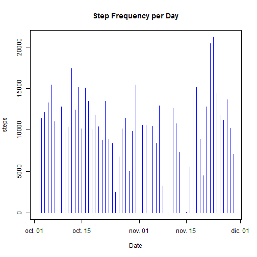
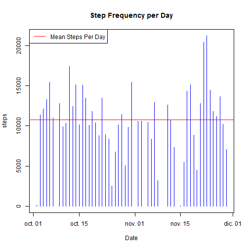
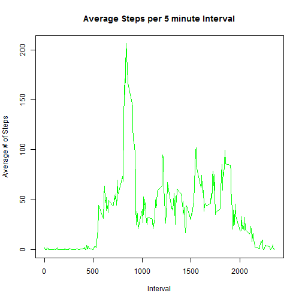
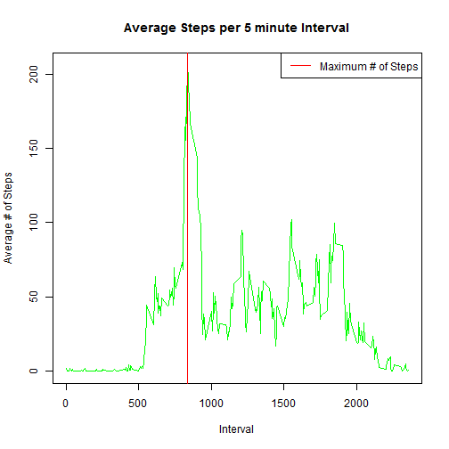
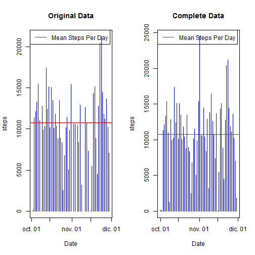
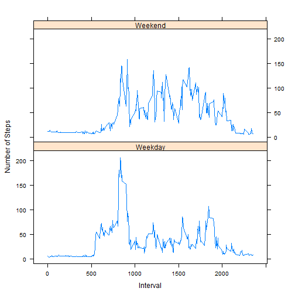

# Assignment

### Loading and preprocessing the data

To load the data, we use the __read.csv()__ command, passing the location of the file we wish to load as a parameter. In this case, since the data is located in a sufolder called "activity", in a file named "activity.csv", we use the following line:


```r
data <- read.csv("activity/activity.csv", stringsAsFactors = FALSE)
```

By doing this, we have loaded the data contained in __activity.csv__ and stored it in a data frame called __data__. The additional parameter, __stringsAsFactors = FALSE__, forces R to load the data as it is, instead of producing factors.

We may view a summary of the data by using the __summary()__ command, to get an idea of the type of information we are dealing with.


```r
summary(data)
```

```
##      steps            date              interval     
##  Min.   :  0.00   Length:17568       Min.   :   0.0  
##  1st Qu.:  0.00   Class :character   1st Qu.: 588.8  
##  Median :  0.00   Mode  :character   Median :1177.5  
##  Mean   : 37.38                      Mean   :1177.5  
##  3rd Qu.: 12.00                      3rd Qu.:1766.2  
##  Max.   :806.00                      Max.   :2355.0  
##  NA's   :2304
```

We can see that the date column, corresponding to the day in which the measurement was taken, is loaded as a string. Therefore, we can transform it using the __as.Date()__ command, as shown now.


```r
data$date <- as.Date(data$date)
```

With this small preprocessing, we may start analyzing the data.

### What is mean total number of steps taken per day?

#### 1. Make a histogram of the total number of steps taken each day.

To produce this histogram, we must make a plot that presents the dates on the x-axis, and the sum of steps on that date in the y-axis. Thus, a good way to achieve this easily is to, first, aggregate the __steps__ column by __date__. We do this using the aggregate() function, as follows.


```r
stepsPerDate <- aggregate(steps ~ date, data = data, sum)
```

We may check the contents of this new data frame using the  __head()__ function.


```r
head(stepsPerDate)
```

```
##         date steps
## 1 2012-10-02   126
## 2 2012-10-03 11352
## 3 2012-10-04 12116
## 4 2012-10-05 13294
## 5 2012-10-06 15420
## 6 2012-10-07 11015
```

As we can see, __stepsPerDate__ has two columns, one with an unique value for each date, and the other with the sum of all steps with that date. We may then use the __plot()__ function to display the data in a more informative way, adding the type == "h" parameter to display it as a histogram.


```r
plot(stepsPerDate$date, stepsPerDate$steps, type = "h", xlab = "Date", ylab = "steps", main = "Step Frequency per Day", col = "blue")
```

 

#### 2. Calculate and report the **mean** and **median** total number of steps taken per day

To calculate the mean and median, we simply pass the steps column of the __stepsPerDate__ data frame to the __mean()__ and __median()__ functions. 


```r
meanSteps <- mean(stepsPerDate$steps)
medianSteps <- median(stepsPerDate$steps)
```

```
## [1] "Mean # Steps Per Day: 10766.1886792453"
```

```
## [1] "Median # of Steps Per Day: 10765"
```

Which returns the actual values for each measurement. In addition, we can plot the mean on top of our original plot, to add additional information to it.

 

### What is the average daily activity pattern?

#### 1. Make a time series plot (i.e. `type = "l"`) of the 5-minute interval (x-axis) and the average number of steps taken, averaged across all days (y-axis)

As we did before, we may aggregate the data again, this time aggregating steps per interval, and using mean as the funciton we want to use.


```r
stepsPerInt <- aggregate(steps ~ interval, data = data, mean)
```

We may, again, display the first few lines of the data to understand what we just received.


```r
head(stepsPerInt)
```

```
##   interval     steps
## 1        0 1.7169811
## 2        5 0.3396226
## 3       10 0.1320755
## 4       15 0.1509434
## 5       20 0.0754717
## 6       25 2.0943396
```

As we can see, in each line we now have a unique interval, and the average number of steps per interval. We may again then plot it, with the code below.


```r
plot(stepsPerInt$interval, stepsPerInt$steps, type = "l", xlab = "Interval", ylab = "Average # of Steps", main = "Average Steps per 5 minute Interval", col = "green")
```

 

#### 2. Which 5-minute interval, on average across all the days in the dataset, contains the maximum number of steps?

Analytically, we can see from the plot above that the max corresponds to the peak between the 500 and 1000 minutes. To get the exact value, we may use the __max()__ function on the steps column of the StepsPerInt data frame. However, this will only give us the maximum value, not the interval with it. To find the index (i.e. row number within the data frame) we need to use the __which.max()__ which returns the index of the item containing the maximum. Then, we may use it to check the interval column of the __stepsPerInt__ data set, and retrieve the maximum.


```r
maxMeanStepsInd <- which.max(stepsPerInt$steps)
maxMeanSteps <- stepsPerInt$interval[maxMeanStepsInd]
```

```
## [1] "Time interval with highest average # of steps: 835"
```

Once we have the max value (835 minutes) we may also plot it on our original plot, to verify the result.

 

### Imputing missing values

Note that there are a number of days/intervals where there are missing
values (coded as `NA`). The presence of missing days may introduce
bias into some calculations or summaries of the data.

#### 1. Calculate and report the total number of missing values in the dataset (i.e. the total number of rows with `NA`s)

The __complete.cases()__ function allows us to obtain a logical vector with the number of rows that are complete in a data frame. Since we wish to know which as missing, we may use the __!__ operator to obtain compliment of the binary vector, and the use the __sum()__ function to sum the number of ones in the vector, corresponding to each missing row


```r
sum( !complete.cases(data) )
```

```
## [1] 2304
```

Telling us that there are 2304 rows with at least one missing value.

#### 2. Devise a strategy for filling in all of the missing values in the dataset. The strategy does not need to be sophisticated. For example, you could use the mean/median for that day, or the mean for that 5-minute interval, etc.

A simple way of filling in the data with the missing values, can be to use the average steps per day per interval we calculated before (stored in the __stepsPerInt__ data frame) to selectively fill in the missing values with the value corresponding to the mean of interval across all days.

First, we must obtain the indices of each row that has a missing value. We may do this by using the __which()__ function on our __complete_cases()__ results.


```r
hasNA <- which (!complete.cases(data))
head(data[hasNA, ])
```

```
##   steps       date interval
## 1    NA 2012-10-01        0
## 2    NA 2012-10-01        5
## 3    NA 2012-10-01       10
## 4    NA 2012-10-01       15
## 5    NA 2012-10-01       20
## 6    NA 2012-10-01       25
```

Then, what we want to do is to take the value that corresponds to the __interval__ of the missing __steps__ and fill it in. We may do this by using the __merge()__ function. This function allows us to combine two data frames based on one or several of their columns. In the code below, we extract the rows with missing data from our original data set, and then use merge to combine the __stepsPerInt__ data frame (which contains the means per interval) with the missing values.


```r
missingData <- data[hasNA, ]
filledData <- merge(x = missingData, y = stepsPerInt, by = "interval", all.x=TRUE)
```

We may visualize the effect of the merge using __head()__


```r
head(filledData)
```

```
##   interval steps.x       date  steps.y
## 1        0      NA 2012-10-01 1.716981
## 2        0      NA 2012-11-30 1.716981
## 3        0      NA 2012-11-04 1.716981
## 4        0      NA 2012-11-09 1.716981
## 5        0      NA 2012-11-14 1.716981
## 6        0      NA 2012-11-10 1.716981
```


As we can see, there are now two steps columns, one corresponding to the "x" data frame, the original data with missing values, and one for the second data frame, containing the means per interval. Thus, we now have added the means to each missing value, and can just drop the column with missing data, and replace it with the mean. 

#### 3. Create a new dataset that is equal to the original dataset but with the missing data filled in.

Since we have the __filledData__ data set, we can just take the __steps.y__ column of the data, and use it to replace the __steps__ values for the rows with missing data in the original dataset.


```r
dataComplete <- data
dataComplete[hasNA,"steps"] <- filledData$steps.y
head(dataComplete[hasNA,])
```

```
##      steps       date interval
## 1 1.716981 2012-10-01        0
## 2 1.716981 2012-10-01        5
## 3 1.716981 2012-10-01       10
## 4 1.716981 2012-10-01       15
## 5 1.716981 2012-10-01       20
## 6 1.716981 2012-10-01       25
```

As we can see, now the missing data has been filled.

#### 4. Make a histogram of the total number of steps taken each day and Calculate and report the **mean** and **median** total number of steps taken per day. Do these values differ from the estimates from the first part of the assignment? What is the impact of imputing missing data on the estimates of the total daily number of steps?

For this part, we may "reclycle" some of our code from the first exercise, aggregating our new __completeData__ data frame over dates, and then plotting it, along with its mean and median. We may additionally plot the original mean and median to evaluate the possible changes.


```r
newStepsPerDate <- aggregate(steps ~ date, data = dataComplete, sum)

newMeanSteps <- mean(newStepsPerDate$steps)
newMedianSteps <- median(newStepsPerDate$steps)

par(mfrow=c(1,2)) ##Set two plots horizontally aligned.

##Make the 1st Plot, with the original dataset...
plot(stepsPerDate$date, stepsPerDate$steps, type = "h", xlab = "Date", ylab = "steps", main = "Original Data", col = "blue")
abline(h = meanSteps, col = "red")
legend("topleft", lty = 1, col = c("red"), legend = c("Mean Steps Per Day"))

##Make the 2nd Plot, with the completed dataset...
plot(newStepsPerDate$date, newStepsPerDate$steps, type = "h", xlab = "Date", ylab = "steps", main = "Complete Data", col = "blue")
abline(h = meanSteps, col = "red")
legend("topleft", lty = 1, col = c("red"), legend = c("Mean Steps Per Day"))
```

 


```
## [1] "Mean # Steps Per Day (original): 10766.1886792453"
```

```
## [1] "Median # of Steps Per Day (original): 10765"
```

```
## [1] "Mean # Steps Per Day (complete): 10766.1886792453"
```

```
## [1] "Median # of Steps Per Day (complete): 11015"
```

We can definitely conclude from this results that, while using the means does affect the distribution of values within the data, thus affecting the median. However, since we are adding values that correspond to the mean, we are not adding data that changes it, and therefore the means of the original and completed data are exactly the same.

### Are there differences in activity patterns between weekdays and weekends?

#### 1. Create a new factor variable in the dataset with two levels -- "weekday" and "weekend" indicating whether a given date is a weekday or weekend day.

Since we want to see the data per weekday and not just by date, it would be convenient to add a new column to the dataset. We can do this using the __mutate()__ from the __dplyr__ library. To transform dates into weekday names, we may use the __weekdays()__ function. Then, we may use as.factor to add a 5th column to the data, this time a factor, with weekend or weekday.


```r
library(dplyr)
dataComplete <- mutate(dataComplete, weekday = weekdays(as.Date(date)))
dataComplete <- mutate(dataComplete, weekDayweekEnd = as.factor(ifelse(weekday %in% c("sábado","domingo"), "Weekend", "Weekday")))
head(dataComplete)
```

```
##      steps       date interval weekday weekDayweekEnd
## 1 1.716981 2012-10-01        0   lunes        Weekday
## 2 1.716981 2012-10-01        5   lunes        Weekday
## 3 1.716981 2012-10-01       10   lunes        Weekday
## 4 1.716981 2012-10-01       15   lunes        Weekday
## 5 1.716981 2012-10-01       20   lunes        Weekday
## 6 1.716981 2012-10-01       25   lunes        Weekday
```

```r
class(dataComplete$weekDayweekEnd)
```

```
## [1] "factor"
```

#### 2. Make a panel plot containing a time series plot (i.e. `type = "l"`) of the 5-minute interval (x-axis) and the average number of steps taken, averaged across all weekday days or weekend days (y-axis). The plot should look something like the following, which was created using **simulated data**:

To produce the panel, we first aggregate, as before, the data based on date, though now we include the new factor we created. This means that by using __aggregate()__ with date and our factor as parameters, we will get a row for each data-factor combination. Then, to produce a plot similar to the one requested, we use the __lattice__ plotting function __xyplot()__.


```r
library(lattice)
aggrData <- aggregate(steps ~ interval * weekDayweekEnd, data = dataComplete, mean)
xyplot(steps ~ interval | weekDayweekEnd, data = aggrData, ylab = "Number of Steps", xlab = "Interval", type = "l", layout = c(1, 2))
```

 
